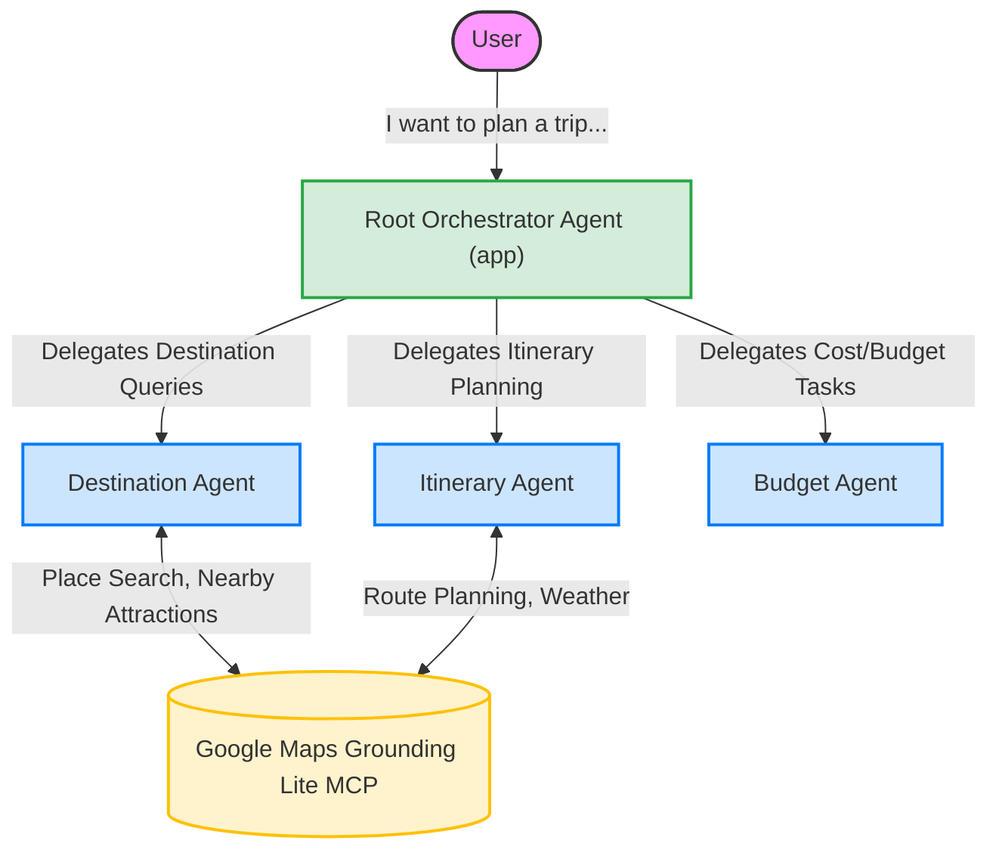

# Travel Concierge: Multi-Agent AI Travel Planner

[](https://cloud.google.com/vertex-ai)

Travel Concierge is a comprehensive, multi-agent AI application designed to eliminate the stress of vacation planning. Built using the **Google Agent Development Kit (ADK)** and powered by **Vertex AI** Gemini models, it orchestrates specialized AI agents to provide personalized destination recommendations, interactive itineraries, and budget tracking—all enhanced by live data via the **Google Maps Grounding Lite MCP**.

## The Problem
Planning a vacation is often a fragmented and overwhelming process. Travelers must juggle dozens of browser tabs to research destinations, cross-reference flight and hotel costs to build a budget, and manually map out daily itineraries. Existing AI chatbots can help with brainstorming, but they struggle to maintain context across complex, multi-faceted planning sessions or interact with real-time location data reliably.

## The Solution
Travel Concierge solves this by employing a **Multi-Agent Orchestration** pattern. Instead of one massive prompt trying to do everything, the system divides the cognitive load among specialized sub-agents:
* A **Destination Agent** focused purely on geography, culture, and discovering the perfect locale.
* An **Itinerary Agent** dedicated to logistics, scheduling, and building day-by-day plans.
* A **Budget Agent** that handles financial constraints and cost estimations.

By providing the agents with real-time access to the physical world via the Google Maps MCP, the resulting itineraries are grounded, accurate, and actionable.

---

## System Architecture

The application utilizes a hierarchical routing architecture built on the Google ADK. A Root Agent acts as the user-facing orchestrator, dynamically delegating tasks to the appropriate sub-agent based on the conversation's intent.



### Key Components
* **Root Agent (`app`)**: The orchestrator that manages conversational state and routes user queries.
* **Specialized Sub-Agents**: 
  * `destination_agent.py`: Brainstorms locations based on user preferences.
  * `itinerary_agent.py`: Creates detailed schedules and logistics.
  * `budget_agent.py`: Tracks estimated costs for travel, lodging, and activities.
* **Model Context Protocol (MCP)**: The official Google ADK `McpToolset` securely integrates the Google Maps API, allowing the Destination and Itinerary agents to fetch live data (places, routes, weather) without hallucinatory guesses.

---

## Folder Structure
```text
travel-concierge/
├── app/                      # Application source code
│   ├── agents/               # Agent definitions
│   │   ├── app/              # Root agent
│   │   ├── budget_agent/     # Budget sub-agent
│   │   ├── destination_agent/# Destination sub-agent
│   │   └── itinerary_agent/  # Itinerary sub-agent
│   ├── maps_mcp.py           # Google Maps MCP integration
│   ├── requirements.txt      # Python dependencies for deployment
│   └── ...
├── prompts/                  # Markdown files containing agent instructions
├── .env.example              # Example environment variables
├── Dockerfile                # Containerization for Cloud Run
├── pyproject.toml            # Python project metadata
└── README.md                 # This file
```

---

## Setup Instructions

### Prerequisites
* Python 3.11+
* `uv` (Python package manager)
* Google Cloud account with Vertex AI enabled
* Google Maps API Key

### 1. Clone the repository
```bash
git clone <your-repository-url>
cd travel-concierge
```

### 2. Virtual Environment & Dependencies
Using `uv` for fast dependency management:
```bash
uv venv
source .venv/bin/activate
uv pip install -e .
```

### 3. Environment Variables
Create a `.env` file based on the provided example:
```bash
cp .env.example .env
```
Edit `.env` to include your actual API keys and Google Cloud project ID.

### 4. Configure Vertex AI Credentials
Authenticate your local environment with Google Cloud:
```bash
gcloud auth application-default login
gcloud config set project YOUR_PROJECT_ID
```

### 5. Obtain a Google Maps API Key
To enable the live data features (MCP):
1. Go to the [Google Cloud Console](https://console.cloud.google.com/).
2. Enable the **Places API (New)** and **Geocoding API**.
3. Go to **APIs & Services > Credentials** and create an API Key.
4. Add the key to your `.env` file as `GOOGLE_MAPS_API_KEY`.

---

## Running Locally

Start the interactive ADK web interface:
```bash
uv run adk web
```
Open your browser to `http://localhost:8000` to start chatting with the Travel Concierge.

### Example User Prompts
* *"I have a budget of $3000 and want to go somewhere warm for 5 days next month. Can you recommend a destination?"*
* *"Create a 3-day itinerary for Tokyo, including popular attractions and nearby restaurants."*
* *"What's the current weather in Paris, and how much would a weekend trip cost?"*

---

## Deployment Instructions

### Option A: Deploying to Google Cloud Run (Recommended for Web UI)
The repository includes a `Dockerfile` optimized for Cloud Run. This exposes the ADK Web UI publicly.
```bash
gcloud run deploy travel-concierge-web \
  --source . \
  --region us-central1 \
  --allow-unauthenticated \
  --set-env-vars GOOGLE_CLOUD_PROJECT=YOUR_PROJECT_ID \
  --set-env-vars GOOGLE_CLOUD_LOCATION=us-central1 \
  --set-env-vars GOOGLE_GENAI_USE_VERTEXAI=True \
  --set-secrets GOOGLE_MAPS_API_KEY=GOOGLE_MAPS_API_KEY:latest
```

### Option B: Deploying to Vertex AI Agent Runtime (Reasoning Engine)
If you wish to deploy the agent as an API endpoint natively within Vertex AI:
```bash
uv run adk deploy agent_engine \
  --project YOUR_PROJECT_ID \
  --region us-central1 \
  --display_name "travel-concierge" \
  app
```
*(Ensure you have configured `GOOGLE_MAPS_API_KEY` in Google Cloud Secret Manager before deploying).*

---

## Future Improvements
* Add user authentication and profile management for saving past itineraries.
* Integrate flight and hotel booking APIs (e.g., Amadeus) via additional MCP tools.
* Support multi-modal inputs allowing users to upload travel inspiration photos.
* Implement long-term memory for returning users using Vertex AI Vector Search.

## License
MIT License. See the `LICENSE` file for details.
